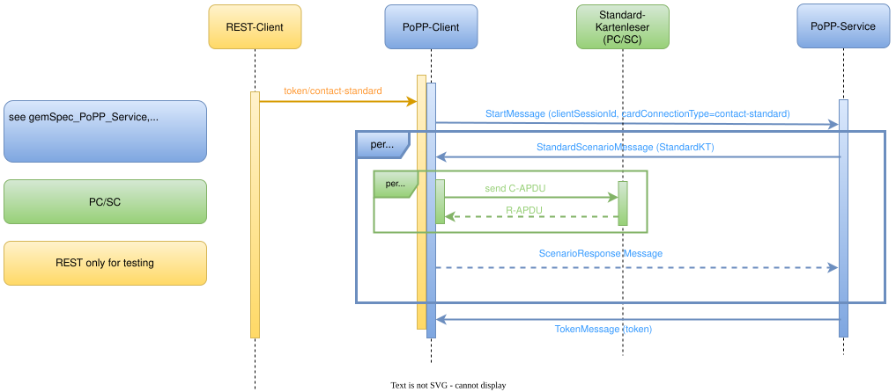
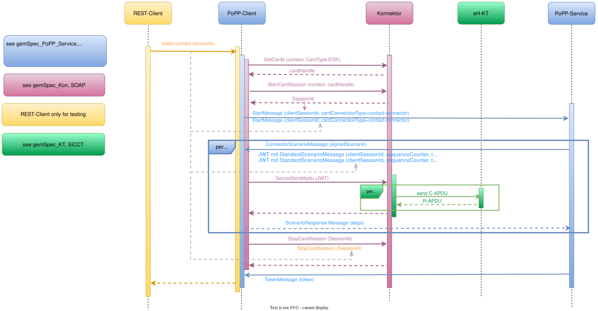
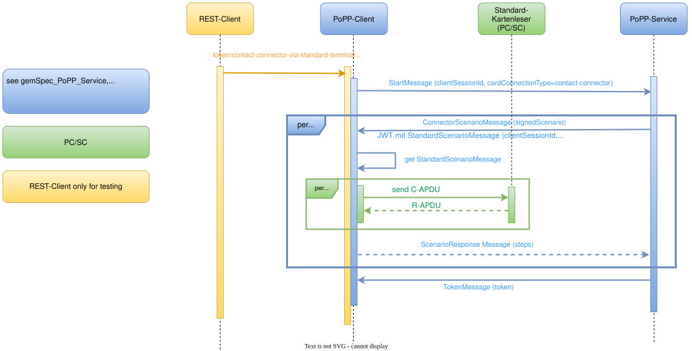

# PoPP Sample Implementation

## Overview

This project provides a sample implementation of the PoPP-Service and
PoPP-Client according to [gemSpec_PoPP_Service](https://gemspec.gematik.de/prereleases/Draft_PoPP_25_1/gemSpec_PoPP_Service_V1.0.0_CC2).
The [eGK-Hash-Datenbank](https://gemspec.gematik.de/prereleases/Draft_PoPP_25_1/gemSpec_PoPP_Service_V1.0.0_CC2/#6.2.1.9) is implemented as PostgresSQL database.

- Supported startup modes:
  - Run the complete local stack via Docker with profile [`dev-local`](#quick-start-docker-full-profile--recommended-for-testing-with-the-virtual-card).
  - Run the PoPP-Client locally and all other components via Docker with profile [`dev-local`](#start-the-popp-client-locally-and-connect-to-the-dockerized-zeta-popp-server-and-egk-hash-datenbank).
  - Run the PoPP-Client against a RISE PoPP-Server without an additional Spring profile using [`application.yaml`](#start-the-popp-client-against-a-rise-popp-server).

The PoPP-Client uses the following profile matrix:

| Target group       | Spring profile | Config file | Default PoPP-Server URL                                                            | Notes |
|--------------------|---|---|------------------------------------------------------------------------------------|---|
| RISE PoPP-Service  | none | `application.yaml` | `wss://popp.dev.poppservice.de:443/popp/practitioner/api/v1/token-generation-ehc` | Access requires allow-listing. |
| local PoPP-Service | `dev-local` | `application-dev-local.yaml` | `wss://popp-zeta-ingress:443/ws` | Used for the local Docker/ZETA stack. |

## Building and running the project locally

## ⚙️ Prerequisites

- **Java JDK/JRE 21**
- **Docker**
- **eGK Testkarten** [if you need some, go to gematik Onlineshop](https://fachportal.gematik.de/gematik-onlineshop/testkarten?ai%5Baction%5D=detail&ai%5Bcontroller%5D=Catalog&ai%5Bd_name%5D=testkarte-egk-g2&ai%5Bd_pos%5D=1)  
- **Standard-Kartenleser** (PC/SC via USB) or
- **Konnektor and eHealth Kartenterminal**

> The keys and p12 stores contained in this repository are intentionally published to allow the project to run out of the box after cloning.

> An exception is the SMC-B certificate and key pair. Please request a test SMC-B at [gematik Anfrageportal](https://service.gematik.de/servicedesk/customer/portal/37).

> Please place them in the docker/zeta/smcb-private folder as follows: 
> - smcb_private.p12 (p12 file with AUT_E256_X509 certificate)
> - smcb_private.alias.txt (alias of the smcb certificate in the p12 file, default is alias)
> - smcb_private.pw.txt (password of the p12 file).

*Notes*

- Ensure ports '8081' (PoPP-Client), `5432` (eGK-Hash-Datenbank) and `8443` (PoPP-Service) are free.
- You can modify `compose.yaml` to fit your environment.

## Step-by-step guide

### Build

```bash
  ./mvnw clean install
```

Optionally without tests:

```bash
  ./mvnw clean install -Dmaven.test.skip=true
```

or 

```bash
  ./mvnw clean install -DskipTests=true
```

### Configuration

Common overrides are available via environment variables such as
`CONNECTOR_END_POINT_URL`, `ZETA_AUTHENTICATION_SMB_KEYFILE` and `POPP_BASEDIR`.
The default value `docker/zeta/smcb-private/smcb_private.p12` is resolved against the current
working directory and, if needed, against its parent directories. This allows the same default
to work both from the repository root and from module directories such as `popp-client`.
If `POPP_BASEDIR` is set, relative paths are resolved against that directory first. This is
useful for Jenkins or external deployments where the repository layout is known but the start
directory may vary.
You can still set `ZETA_AUTHENTICATION_SMB_KEYFILE` explicitly; use an absolute path if in doubt,
for example
`/path/to/repo/docker/zeta/smcb-private/smcb_private.p12`.
The Docker Compose setup overrides that path to `/app/smcb_private.p12`.

Example for CI:

```bash
export POPP_BASEDIR="$WORKSPACE"
```

#### a) Standard-Kartenleser

"Standard-Kartenleser" is a PC/SC card reader, which is typically connected via USB.

By default, the PoPP-Client uses the first Standard-Kartenleser it detects. However, you can specify explicitly which Standard-Kartenleser to use.

```yaml
card-reader:
  name: "<card reader name>"
```

The name is case-sensitive but does not have to be complete, for example with "REINER SCT" the
Standard-Kartenleser named "REINER SCT cyberJack RFID standard 1" will be found.
However, the Standard-Kartenleser must be uniquely identifiable by the abbreviated name. In some cases
of dual-interface readers you must specify the full name to make sure that the right interface is used.


#### b) Konnektor

When generating a PoPP token with your Konnektor, the SMC-B from your Konnektor will be used for the ZETA SDK communication.

**OCSP response for ConnectorScenarioMessages**

The PoPP-Server adds a Base64-encoded DER OCSP response to the `stpl` header of JWT-based ConnectorScenarioMessages.
By default, the server reads the OCSP responder URL from the Authority Information Access (AIA) extension of the
signer certificate and requests the response from that URL. The provider and failure behavior can be configured in
the PoPP-Server YAML configuration. Choose exactly one of the following provider modes.

**Option 1: Retrieve the OCSP response from the responder (`rest`)**

```yaml
certificates:
  ocsp:
    provider: ${OCSP_PROVIDER:rest}
    rest:
      timeout: ${OCSP_TIMEOUT:10s}
```

This mode requests the current response from the OCSP responder URL contained in the certificate.
`certificates.ocsp.rest.timeout` configures the timeout for each request. If the responder remains unavailable,
the request fails with an `OCSP_TIMEOUT` error by default.

To use a static classpath response as a fallback, configure the optional fallback resource:

```yaml
certificates:
  ocsp:
    provider: rest
    rest:
      timeout: 10s
      fallback:
        resource: classpath:/certificates/ocsp/resp.der
```

The presence of `certificates.ocsp.rest.fallback.resource` enables the fallback. Omit the entire `fallback` section
to disable it.

**Option 2: Always use a static OCSP response (`classpath`)**

```yaml
certificates:
  ocsp:
    provider: classpath
    classpath:
      resource: classpath:/certificates/ocsp/resp.der
```

This mode does not contact the responder. It always reads the static response configured by
`certificates.ocsp.classpath.resource`. The `classpath:` prefix is required. The REST timeout and fallback settings
do not apply.

The `dev` profile uses the `rest` provider by default and enables its classpath fallback by configuring
`certificates.ocsp.rest.fallback.resource` as `classpath:/certificates/ocsp/resp.der`. If the OCSP responder remains
unavailable, this static response is used. The fallback resource is validated at application startup and must be
available as a readable classpath resource. To use the `classpath` provider instead, configure
`certificates.ocsp.classpath.resource` separately as shown in option 2.

**Optional: Certificates for TLS**

The PoPP-Client supports TLS connections using [ECC](https://gemspec.gematik.de/docs/gemILF/gemILF_PS/latest/#A_17094-01) for communication with your Konnektor. To enable and configure this, follow the steps below:

1. Enable TLS by setting:

   ```yml
   connector:
     secure:
       enable: true
   ```
* If your Konnektor does not have a resolvable domain name, disable hostname validation:
  
  ```yml
  connector:
    secure:
      hostname-validation: false
  ```
  
* Upload your client certificate (e.g., `keystore.p12`) to the Konnektor client configuration.
* Retrieve the Konnektor certificate (replace `<KONNEKTOR_IP>` and `<PORT>` with your specific Konnektor address):

  ```
  openssl s_client -showcerts -connect <Konnektor_IP>:<PORT>
  ```
  
  Depending on the Konnektor type, you might add a curves parameter to the command, e.g.:

  ```
  openssl s_client -showcerts -connect <Konnektor_IP>:<PORT> -curves brainpoolP256r1
  ```

  or a cipher parameter, e.g.:

  ```
  openssl s_client -showcerts -connect <Konnektor_IP>:<PORT> -cipher ECDHE-ECDSA-AES128-GCM-SHA256
  ```

* Import the Konnektor certificate including the whole trust chain into your truststore (e.g., truststore.p12):

  ```
  keytool -import -alias connector-server -file server-cert.pem -keystore truststore.p12
  ```
  
* Note: The `connector.secure.keystore`, `connector.secure.truststore`, and their respective passwords are used only
  for communication with the Konnektor. This is distinct from the TLS configuration used for communication with 
  the PoPP server.

**Address and context**

Configure your Konnektor address and context:

```yaml
connector:
  end-point-url: <ip address and port of event-service endpoint of Konnektor>
  log-ws: <if SOAP messages should be logged>
  secure:
    enable: <If TLS should be used>
    hostname-validation: <The Hostname of the Konnektor should be validated>
    keystore: <Keystore with the client certificate>
    keystore-password: <Password of the keystore>
    trust-all: <If all certificates should be trusted, only for testing purposes>
    truststore: <Truststore with the Konnektor certificate and its trust chain>
    truststore-password: <Password of the truststore>
  terminal-configuration:  
    context:
      clientSystemId: <ClientSystemId for Konnektor Context>
      workplaceId: <WorkplaceId for Konnektor Context>
      mandantId: <MandantId for Konnektor Context>
    ct-id: <CardTerminalId for specific card terminal>
    ct-slot: <CardTerminalSlot for specific card terminal>
```
Example:

```yaml
connector:
  end-point-url: "http://127.0.0.1"
  log-ws: true
  secure:
    enable: false
    hostname-validation: true
    keystore: keystore.p12
    keystore-password: changeit
    trust-all: false
    truststore: truststore.p12
    truststore-password: changeit
  terminal-configuration:  
    context:
      clientSystemId: "ClientID1"
      workplaceId: "Workplace1"
      mandantId: "Mandant1"
    ct-id: "kt"  
    ct-slot: "2"
```

**Supported Konnektor functions**

- `StartCardSession` - see [StardCardSession in gemSpec_Kon](https://gemspec.gematik.de/docs/gemSpec/gemSpec_Kon/latest/#4.1.5.5.7)
- `SecureSendApdu`   - see [SecureSendApdu in gemSpec_Kon](https://gemspec.gematik.de/docs/gemSpec/gemSpec_Kon/latest/#4.1.5.5.8)
- `StopCardSession`  - see [StopCardSession in gemSpec_Kon](https://gemspec.gematik.de/docs/gemSpec/gemSpec_Kon/latest/#4.1.5.5.9)
- `GetCards`         - see [GetCards in gemSpec_Kon](https://gemspec.gematik.de/docs/gemSpec/gemSpec_Kon/latest/#4.1.6.5.2)
        -- If GetCards finds more than one eGK the first one is used.

#### c) Virtual Card

If you don't have a card reader or Konnektor you can use a virtual card.
This allows testing without any card-related hardware.
The card data will be read from the XML image file specified, and it works for contact based and contactless card images.

Put your XML image in popp-client/src/main/resources to use it.
Either configure your application*.yaml 

```yaml
virtual-card:
  image-file: <XML image file>
```

or change your card during runtime with e.g.

```bash
curl -H 'Content-Type: application/json' \
  -d '{"communicationType":"contact-virtual","virtualCard":"<XML image file>"}' \
  http://localhost:8081/token
```

If you don't specify a new card image in the request, it will automatically use the one in the application*.yaml.
If you specify a new card image, it will overwrite the one in the application*.yaml.

#### d) VZD search

The PoPP-Server provides a mobile search endpoint for retrieving healthcare company information
from the reference FHIR directory (VZD). The server obtains the required VZD access token and
forwards the FHIR search request with that token. Authentication is performed in two steps: first
with the OAuth 2.0 `client_credentials` grant and then against the VZD service-authenticate
endpoint. Access tokens are cached until shortly before they expire.

**Required credentials**

Valid VZD credentials must be provided before using the search:

- `VZD_CLIENT_ID`
- `VZD_CLIENT_SECRET`

To obtain the required credentials, open a ticket via the [gematik Service Desk](https://service.gematik.de/servicedesk/customer/portal/27).

The defaults for both variables are empty. The PoPP-Server can start without them, but every VZD
search will fail because no access token can be obtained. Do not store credentials in the
repository.

For Bash-compatible shells, set them in the environment from which the PoPP-Server or Docker
Compose is started:

```bash
export VZD_CLIENT_ID="<VZD client ID>"
export VZD_CLIENT_SECRET="<VZD client secret>"
```

For Windows PowerShell:

```powershell
$env:VZD_CLIENT_ID = "<VZD client ID>"
$env:VZD_CLIENT_SECRET = "<VZD client secret>"
```

`docker/compose.yaml` passes these variables to the `popp-server` container. When running the
PoPP-Server locally, Spring reads the same environment variables directly.

The reference environment endpoints are configured by default. They can be overridden if needed:

| Environment variable | Purpose | Default |
|---|---|---|
| `TOKEN_URL` | OAuth token endpoint for the TI provider token | `https://auth-ref.vzd.ti-dienste.de:9443/auth/realms/Service-Authenticate/protocol/openid-connect/token` |
| `SERVICE_AUTH_URL` | Endpoint for exchanging the TI provider token for the VZD access token | `https://fhir-directory-ref.vzd.ti-dienste.de/service-authenticate` |
| `TOKEN_SKEW_SECONDS` | Safety margin subtracted from the access-token lifetime | `30` |

**Using the search**

The mobile endpoint accepts a complete FHIR-VZD search or pagination URL in the required
`searchrequest` query parameter:

```text
GET http://localhost:8443/popp/patient/api/v1/mobile/fhirvzdsearch?searchrequest=<FHIR-VZD URL>
```

For example, the following request searches active healthcare services for `Berlin`, includes
their organization and location, and requests up to 20 results:

```bash
curl --get "http://localhost:8443/popp/patient/api/v1/mobile/fhirvzdsearch" \
  --data-urlencode "searchrequest=https://fhir-directory-ref.vzd.ti-dienste.de/search/HealthcareService?organization.active=true&_include=HealthcareService:organization&_include=HealthcareService:location&_text=Berlin&_count=20&_offset=0&_format=json"
```

The response contains the matching organizations with their name, Telematik-ID, IKNR, address and
contact data. A URL returned for the next result page can be passed back unchanged as
`searchrequest`. Searches with more than 100 total results are rejected with HTTP status `422`; in
this case, narrow the FHIR search criteria.

## Execution

### Quick start (Docker, full profile – recommended for testing with the virtual card)


For a quick **out-of-the-box setup** (including **PoPP-Client**, **PoPP-Service**, and the **eGK-Hash-Datenbank**),
this project provides a Docker Compose **`full` profile**.

This mode is especially useful for:

- testing the **virtual card**
- running the complete PoPP stack without card readers or a Konnektor

#### 1. Build Docker images via Maven

Docker images are built as part of the Maven build.  
Make sure Docker image creation is **enabled**:

```bash
./mvnw clean install -Dskip.dockerbuild=false
```
This step builds the Docker images `local/popp/popp-server:<version>` and `local/popp/popp-client:<version>`, as well as
`local/popp/popp-server:latest` and `local/popp/popp-client:latest`. The latter is the default version in the compose.yaml.

#### 2. Start the full stack via Docker Compose

```bash
docker compose -f docker/compose.yaml --profile full up
```

The compose setup starts the client with `SPRING_PROFILES_ACTIVE=dev-local`.

This starts:

- PoPP-Server
- eGK-Hash-Datenbank (PostgreSQL)
- PoPP-Client (without card reader/Konnektor, using virtual card)

#### 3. Verify startup

Once all containers are running, the following endpoints are available:

- PoPP-Client Swagger UI: <http://localhost:8081/swagger-ui.html>

#### 4. Testing with a virtual card

The full Docker profile is intended to be used together with the virtual card configuration. You can test it via the 
Swagger-Ui with the `/token` endpoint as described below with the communication type `contact-virtual` or `contactless-virtual`.

This allows testing PoPP flows without any card-related hardware.

#### 5. Systematic test example: restart the full local Docker stack and verify virtual card flow

This test verifies the fully dockerized setup, including the dockerized PoPP-Client.

Stop the complete local stack first:

```bash
docker compose -f docker/compose.yaml --profile full down --remove-orphans
```

Start the complete local stack again:

```bash
docker compose -f docker/compose.yaml --profile full up -d
```

Check the container status:

```bash
docker compose -f docker/compose.yaml --profile full ps
```

The PoPP-Client should be up and healthy on port `8081`.

Run the virtual card token flow:

```bash
curl -H 'Content-Type: application/json' \
  -d '{"communicationType":"contact-virtual"}' \
  http://localhost:8081/token
```

For the contactless virtual card flow, use:

```bash
curl -H 'Content-Type: application/json' \
  -d '{"communicationType":"contactless-virtual"}' \
  http://localhost:8081/token
```

Expected result:

```json
{
  "status": "OK",
  "token": "<PoPP token>"
}
```

If you want to execute the same check from inside the client container, use:

```bash
docker exec popp-client curl -H 'Content-Type: application/json' \
  -d '{"communicationType":"contact-virtual"}' \
  http://localhost:8081/token
```

### Start the PoPP-Client locally and connect to the Dockerized Zeta, PoPP-Server and eGK-Hash-Datenbank

This mode is especially useful for testing the complete PoPP stack with card readers or a Konnektor.
Use the `dev-local` profile for the client.

*For ZETA:*

- Ensure you have the following entry in your "hosts" file (e.g. in Windows under C:\Windows\System32\drivers\etc):

```bash
  127.0.0.1 popp-zeta-ingress
```

- The default local profile expects `popp-zeta-ingress` on port `443`.
- The `popp-zeta-ingress` host entry is mandatory for local client starts. The client uses that
  hostname both for the WebSocket endpoint and for the ZETA discovery and authorization endpoints.
- If you change the published port in `docker/compose.yaml`, override the URL with
  `POPP_SERVER_URL=wss://popp-zeta-ingress:<your_port>/ws`.

#### 1. Build Docker images via Maven as above

#### 2. Start all components except the PoPP-Client via Docker Compose

```bash
docker compose -f docker/compose.yaml up
```

This starts:

- Zeta
- PoPP-Server
- eGK-Hash-Datenbank (PostgreSQL)

#### 3. Start the PoPP-Client locally

For Maven:

```bash
./mvnw -pl popp-client spring-boot:run -Dspring-boot.run.profiles=dev-local
```

For an IDE start:

- activate profile `dev-local`

#### 4. Verify startup as above

### Start the PoPP-Client against a RISE PoPP-Server

#### Prerequisites:

Configure the `application.yaml` to match your setup. The correct endpoint
```
wss://popp.dev.poppservice.de:443/popp/practitioner/api/v1/token-generation-ehc
```
is already included.

#### 1a. Start the PoPP-Client locally

```bash
./mvnw -pl popp-client spring-boot:run
```

#### 1b. Start the PoPP-Client via Docker

```bash
docker run --rm -p 8081:8081 -p 9001:9001 \
  -v "$PWD/docker/zeta/smcb-private/smcb_private.p12:/app/smcb_private.p12:ro" \
  -e ZETA_AUTHENTICATION_SMB_KEYFILE=/app/smcb_private.p12 \
  local/popp/popp-client:latest
```

#### 4. Verify startup as above

### Executing the tests

To execute the tests for the whole project, run the following command:

```bash
  ./mvnw clean test
```

To execute also the integration tests, run the following command:

```bash
  ./mvnw clean verify
```

To execute the tests for a specific module, use the `-pl` option to specify the module name. For example, to run the tests for the `popp-client` module, run:

```bash
  ./mvnw -pl popp-client clean test
```

## Generate a PoPP-Token

The client provides the following POST endpoint to generate a PoPP-Token:

```
POST http://localhost:8081/token
```

With Request Body:

```json
{
  "communicationType": "<one of the supported types>",
  "clientSessionId": "<optional>",
  "patientId": "<optional>"
}
```

The request parameter `clientsessionid` is optional. If set, the `clientsessionid` will overwrite the Konnektor `clientsessionid` from `StartCardSession`.
For `communicationType` values `contact-connector` and `contactless-connector`, a specific eGK card can be selected by providing the optional `patientId` field in the `/token` request body. 
Configured `ct-id`/`ct-slot` values take precedence over KVNR-based selection.

The communication type must be one of the following:

- `contact-standard`
  - use contact-based interface from Standard-Kartenleser
- `contactless-standard`
  - use contactless interface from Standard-Kartenleser
- `contact-virtual`
  - use a virtual card from a card image file, no card reader needed
- `contactless-virtual`
  - use a contactless virtual card from a card image file, no card reader needed
- `contact-connector`
  - use contact-based interface from eHealth-Kartenterminal via Konnektor
- `contactless-connector`
  - use contactless interface from eHealth-Kartenterminal via Konnektor
- `contact-connector-via-standard-terminal`
  - generate sample messages for Konnektor via contact-based interface from Standard-Kartenleser \

Please ensure before using a contactless card reader or connector that the hash values of the eGK have already been stored in the hash DB.

### Example usage

To generate a PoPP token, you can use the Swagger UI. Open the following URL in your browser:
[http://localhost:8081/swagger-ui.html](http://localhost:8081/swagger-ui.html)

Alternatively, you can use this `curl` command in the terminal, e.g.:

```bash
curl -X POST http://localhost:8081/token \
  -H "Content-Type: application/json" \
  -d '{
    "communicationType": "contact-standard",
    "clientSessionId": "123456"
  }'
```
 
To view the generated PoPP-Token, check the console output of the client. 

For PoPP-Token claims see [api-popp](https://github.com/gematik/api-popp/blob/main/src/openapi/I_PoPP_Token_Generation.yaml).

## Sequence diagrams
### PoPP-Token with Standard-Kartenleser


### PoPP-Token with Konnektor


### PoPP-Token with Standard-Kartenleser instead of Konnektor for generating sample messages


## License

Copyright 2025-2026 gematik GmbH

Apache License, Version 2.0

See the [LICENSE](./LICENSE) for the specific language governing permissions and limitations under the License

## Additional Notes and Disclaimer from gematik GmbH

1. Copyright notice: Each published work result is accompanied by an explicit statement of the license conditions for use. These are regularly typical conditions in connection with open source or free software. Programs described/provided/linked here are free software, unless otherwise stated.
2. Permission notice: Permission is hereby granted, free of charge, to any person obtaining a copy of this software and associated documentation files (the "Software"), to deal in the Software without restriction, including without limitation the rights to use, copy, modify, merge, publish, distribute, sublicense, and/or sell copies of the Software, and to permit persons to whom the Software is furnished to do so, subject to the following conditions:
    1. The copyright notice (Item 1) and the permission notice (Item 2) shall be included in all copies or substantial portions of the Software.
    2. The software is provided "as is" without warranty of any kind, either express or implied, including, but not limited to, the warranties of fitness for a particular purpose, merchantability, and/or non-infringement. The authors or copyright holders shall not be liable in any manner whatsoever for any damages or other claims arising from, out of or in connection with the software or the use or other dealings with the software, whether in an action of contract, tort, or otherwise.
    3. The software is the result of research and development activities, therefore not necessarily quality assured and without the character of a liable product. For this reason, gematik does not provide any support or other user assistance (unless otherwise stated in individual cases and without justification of a legal obligation). Furthermore, there is no claim to further development and adaptation of the results to a more current state of the art.
3. Gematik may remove published results temporarily or permanently from the place of publication at any time without prior notice or justification.
4. Please note: Parts of this code may have been generated using AI-supported technology. Please take this into account, especially when troubleshooting, for security analyses and possible adjustments.